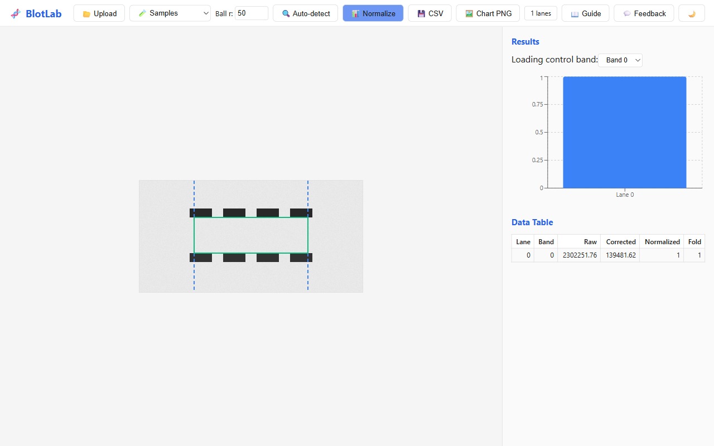

# BlotLab — Western Blot Densitometry in Your Browser

BlotLab replaces the 15-step ImageJ workflow for western blot quantification with a drag-and-drop web tool. Upload a blot image, auto-detect lanes and bands, and get normalized intensity measurements — all client-side, no server required.



## Features

- **Image Upload** — drag-and-drop or file picker for TIFF, PNG, and JPEG blot images
- **Rolling Ball Background Subtraction** — same algorithm as ImageJ, with configurable ball radius
- **Auto Lane Detection** — automatic vertical lane boundary detection from intensity profiles, with manual adjustment
- **Band Detection & ROI** — auto-detect horizontal intensity peaks within each lane, or click-drag to draw band regions
- **Densitometry** — integrated pixel intensity per band with local background subtraction
- **Normalization** — normalize to a loading control band (GAPDH, β-actin) per lane
- **Fold Change** — compute fold change relative to a control lane
- **Bar Chart** — visualize normalized band intensities with Recharts
- **CSV Export** — download lane, band, raw intensity, normalized intensity, and fold change
- **Canvas Editor** — zoom, pan, brightness/contrast sliders, lane and band overlays
- **Dark/Light Theme** — toggle between themes from the toolbar

## Quick Start

```bash
git clone <repo-url> && cd blotlab
pnpm install
pnpm dev
# Open http://localhost:1440
```

## Key Equations

| Concept | Formula |
|---|---|
| Background subtraction | `corrected[x,y] = original[x,y] - background[x,y]` |
| Integrated intensity | `I = Σ(pixel values within ROI)` |
| Normalization | `normalized = target_band_intensity / loading_control_intensity` |
| Fold change | `fold = normalized_sample / normalized_control` |
| Rolling ball | Morphological erosion followed by dilation with spherical structuring element |

## Tech Stack

- **TypeScript** — end-to-end type safety
- **React 19** — UI components
- **Vite 6** — dev server and build
- **Vitest** — unit tests (7 test suites covering the full engine)
- **Recharts** — bar chart visualization
- **Canvas API** — client-side image processing with typed arrays

## Project Structure

```
packages/
  engine/       # Image processing core (background, lanes, bands, densitometry, normalize, export)
  web/          # React + Vite UI (CanvasPanel, ResultsPanel, Toolbar)
  cli/          # Node runner for batch processing
```

## License

MIT
